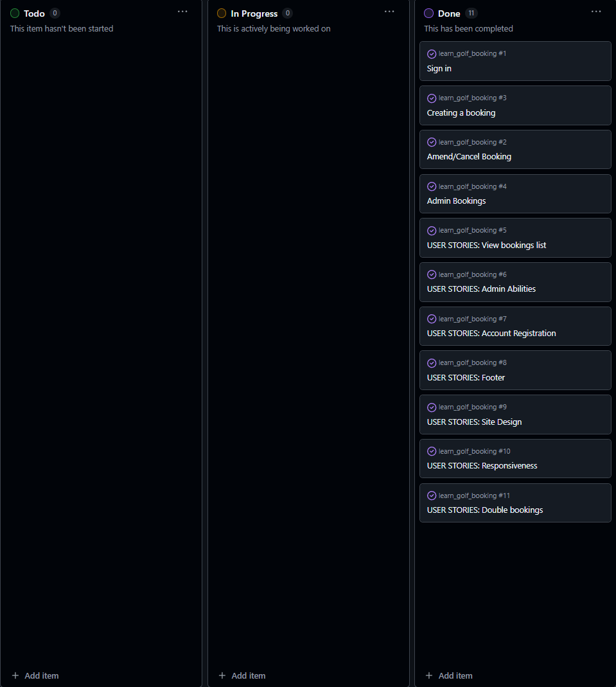
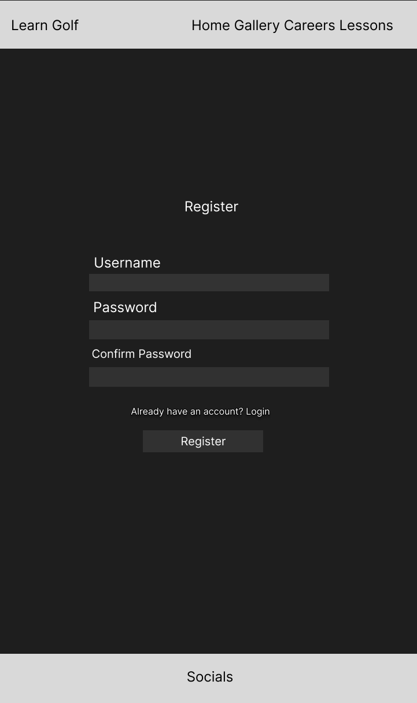
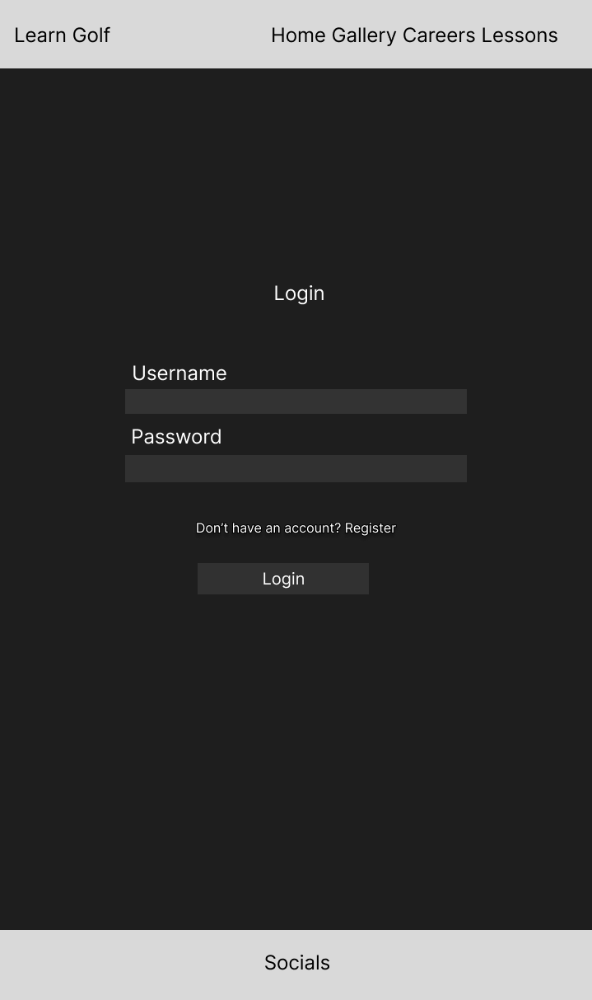
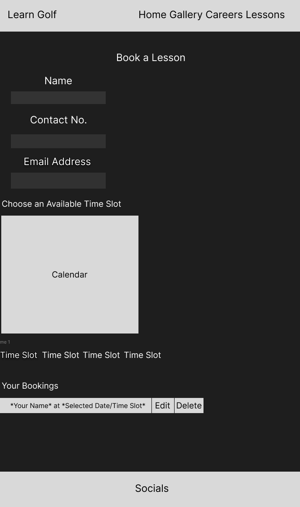

# LEARN GOLF

"Learn Golf" is a django based website with the aim to convince people to take up golf. The site informs people on what careers paths are available through golf and also provides information on how to achieve a career as a professional golfer aswell as offering lessons to beginners.  
- - -

## Table of Contents
### [User Experience](#user-experience-ux)
* [Project Goals](#project-goals)
* [Agile Methodology](#agile-methodology)
* [Target Audience](#target-audience)
* [First time user](#first-time-user)
* [Registered user](#registered-user)
* [Admin user](#admin-user)
### [Design](#design-1)
* [Color Scheme](#color-scheme)
* [Cabin Images](#cabin-images)
* [Wireframes](#wireframes)
* [Data Model](#data-models)
* [User Journey](#user-journey)
* [Database Scheme](#database-scheme)
### [Security Features](#security-features-1)
### [Features](#features-1)
* [Existing Features](#existing-features)
* [Features Left to Implement](#features-left-to-implement)
### [Technologies Used](#technologies-used-1)
* [Languages Used](#languages-used)
* [Databases Used](#databases-used)
* [Frameworks Used](#frameworks-used)
* [Programs Used](#programs-used)
### [Deployment and Local developement](#deployment-and-local-developement-1)
* [Local Developement](#local-developement)
* [ElephantSQL Database](#elephantsql-database)
* [Cloudinary](#cloudinary)
* [Heroku Deployment](#heroku-deployment)
### [Testing](#testing-1)
### [References](#references-1)
* [Docs](#docs)
* [Content](#content)
* [Acknowledgments](#acknowledgments)

- - -

## User Experience (UX)

Become captivated by the benefits and career oppurtunities provided by taking up golf. The site offers intuitive navigation, satisfying visuals and a simple, effortless booking system where you can also tailor your experience to what you require. This can be also be done on the go as the site is also mobile friendly!

### Project Goals

The goal of the Learn Golf project is to create an immersive and user-friendly online platform that allows users to learn, book, and experience golf and what it has to offer. The project aims to provide a seamless user experience, promoting the aesthetic of golf through captivating golf themed visuals, extensive information and a booking process for however many lessons the user desires.

### Agile Methodology

Agile Methodology was used to help prioritize and organize tasks, writing the user stories and using Project Boards on Github. A template was created to help write User Stories and define Epics

* User stories were created and through iterations the project was advancing.
* Project Board is set to public.
* Project Board was used to track progression of the task through the Todo, In progress and Done columns
* Labels were added to sort the issues based on the importance.

 Project Board

### User Stories

1. Account Registration
* Registration page
* User log in and log out
* Display users name
2. Admin Abilities
* Amend/Cancel Bookings
* Crud functionality
* Admin panel
* View bookings list
* Double bookings
4. Site design
* Responsiveness

Detailed look can be found in the [project board](https://github.com/users/LewisClements21/projects/2/views/1)

### Target Audience

* Individuals who are looking to try golf aswell as those who have never thought about it.
* Golfers looking for an effortless booking process for lessons with a PGA pro to help improve their game.
* Users who value a captivating and visually appealing online experience.
* Mobile users who want the convenience of booking their lessons from any device.

### First time user

* Easy and intuitive website navigation.
* Engaging visuals showcasing golf and what it has to offer.
* Informative content providing an insight into what to expect when getting into golf
* User-friendly forms with clear validation messages to ensure correct input.
* Simple Registration process.

### Registered User

* Effortless login process with a secure and personalized user account.
* Access to all of the users bookings with the ability to edit or delete them allowing flexibility and convenience.
* Ability to book as many lessons as the user desires.

### Admin user

* Secure and separate login portal for admin users with appropriate access control.
* Access to an admin dashboard for managing bookings.
* Ability to add, edit, or delete bookings and change availability.
* Ability to delete user accounts, providing the necessary control for managing user data and accounts.

## Design

The Learn Golf website boasts a visually appealing golf inspired design. Grassy colour scheme promotes a sense of being already involved and on the course. The navigation bar features a logo and easy-to-read text. Inspiring photos are displayed in a Gallery page for the user to view at their own enjoyment. The about section utilizes a dark background and horizontal lines for clarity. Social media links are presented in the footer which also complements the overall golf design.

### Course Images

All images in the booking section and in the gallery were provided by a close friend who is a PGA professional golfer.

### Logo

The logo was taken from a simple font awesome icon. [Font Awesome](https://fontawesome.com/)

### Typography

The 'kanit' font was used as the primary font with sans-serif set as a back up.

### Wireframes

 Register Page

 Login Page

 Booking Page

### Data Models

1. AllAuth User Model
    * Django Allauth, the User model is the default user model provided by the Django authentication system
    * The User entity has a one-to-many relationship with the Booking entity. This means that a User can have multiple Bookings, but each Booking is associated with only one User.
---
2. Booking Model
    * A User can have multiple Bookings, but each Booking is associated with only one User. This is represented by the foreign key relationship between User and Booking.
    * Booking model has a feature that prevents overlapping bookings, so users dont book on the same dates/times
    * Full CRUD functionality is available to the user.
    * User in order to book has to fill out their contact information and specify if they would prefer a simulator lesson or an on course lesson. The user is also presented with the option to hire clubs
---

## Security Features

### User Authentication

* Django Allauth is a popular authentication and authorization library for Django, which provides a set of features for managing user authentication, registration, and account management.

### Login Decorator

* book_lessons, success, booking_update, and booking_delete: These views involve operations related to user bookings and require authentication with the login_required decorator.
* This ensures that only authenticated users can access these views.

### CSRF Protection

* Django provides built-in protection against Cross-Site Request Forgery (CSRF) attacks. CSRF tokens are generated for each user session, and they are required to submit forms or perform state-changing actions. When a user logs out, the session and associated CSRF token are invalidated, making it difficult for an attacker to forge a valid request using a copied URL.

### Form Validation

* The book_lessons view validates form input using the BookingForm class. It checks for various validation errors, such as the date/time and overlapping bookings.

### Overlapping Booking

* In the book_lessons view, the code checks for overlapping bookings by querying the database for existing bookings that match certain conditions. It compares the selected dates with the dates of existing bookings for the same date/time. If any overlapping bookings are found, they will not be displayed as an option to the user. The view also makes sure the user cannot book a date in the past.

### Custom error pages

* 404 Error Page, provides user with a button the redirect to home page.
* 500 Error Page, provides user with a button the redirect to home page.

## Features

* Home page showcases reasons for the user to learn how to play golf, including the social and health benefits that accompany it.
* The website features a descriptive page of careers that can be achieved through golf.
* User can make an account and login
* When logged in, users get access to the lessons overview and are able to book more.
* Users can edit and delete their bookings

### Existing Features

* Home Page
    * Displays a navigation bar with the logo, main heading, Golf Benefits section and a footer with socials.
* Logo
    * Logo was created using [FontAwesome](https://fontawesome.com/)
* Gallery Page
    * Contains a collage of photos taken on some of the most beautiful courses around Scotland.
* Sign Up
    * The user can create an account
* Login
    * User can login to their account after they have created one.
* Logout
    * User can logout when they are done.
* Create a booking
    * User can create a booking by filling out their personal details on the form in the bookings page which then provides them with a calendar with available dates and times.
    * Form validation is implemented to make sure the form is submitted correctly and if there is an error the user will be notified.
    * Form also contains checkboxes to hire clubs or change the lesson type which arent required fields.
* Booking Successful
    * If a booking is successful, user is notified and prompted to create another booking at their own leisure.
* Booking overview 
    * Includes all the users bookings which have buttons to edit or delete the bookings.
* Already Booked Dates
    * User wont be able to book dates/times that are already booked by them or other users.
    * Dates in the past arent selectable.
* Edit Booking
    * Users can amend their bookings and save the changes.
* Delete Booking
    * Users can delete their bookings with a delete modal asking for the user to confirm deletion.
* Admin Features
    * Django built in admin panel allows admin control over the website.
    * Can add, update, delete bookings.
    * Create Bookings, update existing bookings.
    * Delete accounts, verify personal info.

### Features Left to Implement 

* Lesson Reviews: Allows the teacher to leave reviews and feedback for learning users.
* Confirmation Email: Sends and email to the user at their request which includes all their booking information for their own reference.
* Online Payment: Implement an online payment system to allow users to securely make payments for their lessons directly through the website.
* For the purposes of this project these implemenations were not necessary.

## Technologies used

### Languages used

* [HTML5](https://en.wikipedia.org/wiki/HTML5)
* [CSS3](https://en.wikipedia.org/wiki/CSS)
* [JavaScript](https://en.wikipedia.org/wiki/JavaScript)
* [Python](https://en.wikipedia.org/wiki/Python_(programming_language))

### Databases used

* [ElephantSQL](https://www.elephantsql.com/) - Postgres database
* [Cloudinary](https://cloudinary.com/) - Online static file storage

### Frameworks used 

* [Django](https://www.djangoproject.com/) - Python framework

### Programs used 

* [Github](https://github.com/) - Storing the code online
* [Gitpod](https://www.gitpod.io/) - To write the code.
* [Heroku](https://www.heroku.com/) - Used as the cloud-based platform to deploy the site.
* [Google Fonts](https://fonts.google.com/) - Import main font the website.
* [Figma](https://www.figma.com/) - Used to create wireframes and schemes
* [Am I Responsive](https://ui.dev/amiresponsive) - To show the website image on a range of devices.
* [Git](https://git-scm.com/) - Version control
* [Jinja](https://jinja.palletsprojects.com/en/3.1.x/) - Templating engine
* [Favicon Generator](https://realfavicongenerator.net/) - Used to create a favicon
* [JSHint](https://jshint.com/) - Used to validate JavaScript
* [W3C Markup Validation Service](https://validator.w3.org/) - Used to validate HTML
* [CSS Validation Service](https://jigsaw.w3.org/css-validator/) - Used to validate CSS
* [CI Python Linter](https://pep8ci.herokuapp.com/#) - Used to validate Python

## Deployment and Local Developement

Live deployment can be found on this [View Learn Golf live website here](https://learn-golf-booking-f01bc1c04312.herokuapp.com/)

### Local Developement

#### How to Fork
1. Log in(or Sign Up) to Github
2. Go to repository for this project [Learn Golf](https://github.com/LewisClements21/learn_golf_booking)
3. Click the fork button in the top right corner

#### How to Clone
1. Log in(or Sign Up) to Github
2. Go to repository for this project [Learn Golf](https://github.com/LewisClements21/learn_golf_booking)
3. Click on the code button, select whether you would like to clone with HTTPS, SSH or GitHub CLI and copy the link shown.
4. Open the terminal in your code editor and change the current working directory to the location you want to use for the cloned directory.
5. Type the following command in the terminal (after the git clone you will need to paste the link you copied in step 3 above)
6. Set up a virtual environment (this step is not required if you are using the Code Institute Template in GitPod as this will already be set up for you).
7. Install the packages from the requirements.txt file - run Command pip3 install -r requirements.txt

### ElephantSQL Database
[Learn Golf](https://github.com/LewisClements21/learn_golf_booking) is using [ElephantSQL](https://www.elephantsql.com/) PostgreSQL Database

1. Click Create New Instance to start a new database.
2. Provide a name (this is commonly the name of the project: tribe).
3. Select the Tiny Turtle (Free) plan.
4. You can leave the Tags blank.
5. Select the Region and Data Center closest to you.
6. Once created, click on the new database name, where you can view the database URL and Password.

### Cloudinary
[Learn Golf](https://github.com/LewisClements21/learn_golf_booking) is using [Cloudinary](https://cloudinary.com/)
1. For Primary interest, you can choose Programmable Media for image and video API.
2. Optional: edit your assigned cloud name to something more memorable.
3. On your Cloudinary Dashboard, you can copy your API Environment Variable.
4. Be sure to remove the CLOUDINARY_URL= as part of the API value; this is the key.

### Heroku Deployment
* Log into [Heroku](https://www.heroku.com/) account or create an account.
* Click the "New" button at the top right corner and select "Create New App".
* Enter a unique application name
* Select your region
* Click "Create App"

#### Prepare enviroment and settings.py
* In your GitPod workspace, create an env.py file in the main directory.
* Add the DATABASE_URL value and your chosen SECRET_KEY value to the env.py file.
* Update the settings.py file to import the env.py file and add the SECRETKEY and DATABASE_URL file paths.
* Comment out the default database configuration.
* Save all files and make migrations.
* Add the Cloudinary URL to env.py
* Add the Cloudinary libraries to the list of installed apps.
* Add the STATIC files settings - the url, storage path, directory path, root path, media url and default file storage path.
* Link the file to the templates directory in Heroku.
* Change the templates directory to TEMPLATES_DIR
* Add Heroku to the ALLOWED_HOSTS list the format ['app_name.heroku.com', 'localhost']

#### Add the following Config Vars in Heroku:

* SECRET_KEY - This can be any Django random secret key
* CLOUDINARY_URL - Insert your own Cloudinary API key
* PORT = 8000
* DISABLE_COLLECTSTATIC = 1 - this is temporary, and can be removed for the final deployment
* DATABASE_URL - Insert your own ElephantSQL database URL here

#### Heroku needs two additional files to deploy properly

* requirements.txt
* Procfile

#### Deploy

1. Make sure DEBUG = False in the settings.py
2. Go to the deploy tab on Heroku and connect to GitHub, then to the required repository.
3. Scroll to the bottom of the deploy page and either click Enable Automatic Deploys for automatic deploys or Deploy Branch to deploy manually. Manually deployed branches will need re-deploying each time the GitHub repository is updated.
4. Click 'Open App' to view the deployed live site.

Site is now live

## Testing
Please see [TESTING.md](TESTING.md) for all the detailed testing performed.

## References
### Docs

* [Stack Overflow](https://stackoverflow.com/)
* [Code Institute](https://learn.codeinstitute.net/dashboard)
* [Django docs](https://docs.djangoproject.com/en/4.2/releases/3.2/)
* [Django Allauth](https://django-allauth.readthedocs.io/en/latest/)
* [Django and Static Assets](https://devcenter.heroku.com/articles/django-assets)
* [Cloudinary](https://cloudinary.com/documentation/diagnosing_error_codes_tutorial)
* [Google](https://www.google.com/)

### Content

* All of the content is imaginary and written by the developer, myself, Lewis Clements.
* All images were willingly provided by a close friend who I am currently learning to play golf from.

### Acknowledgments

* I would like to thank my mentor for support and useful feedback on multiple occaisions throughout this project, Mitko Bachvarov.
* I would also like to extend my appreciation to the Slack community for their continuous engagement and willingness to share knowledge. The collaborative environment provided a platform for learning, troubleshooting, and gaining inspiration from fellow developers.