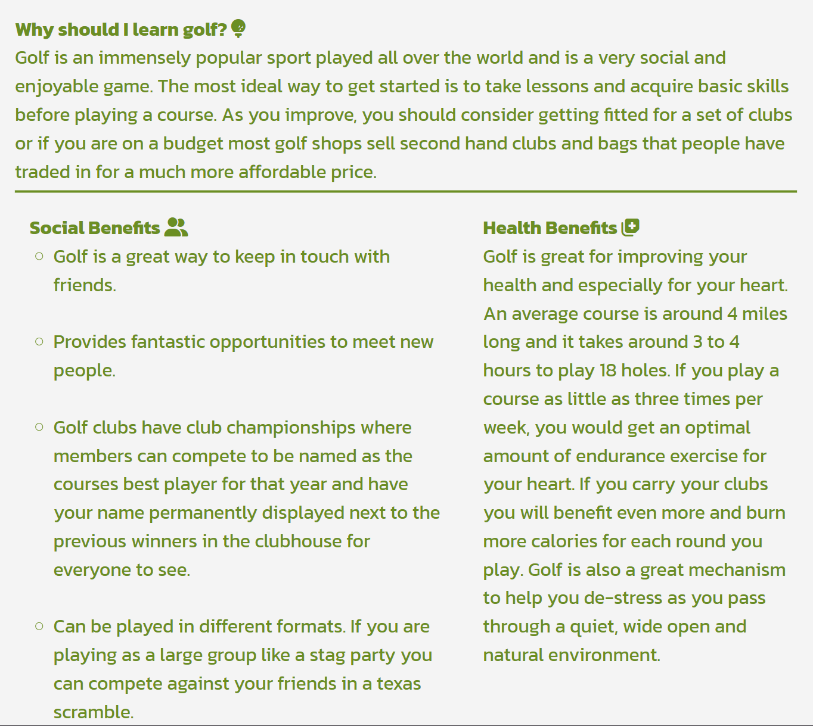
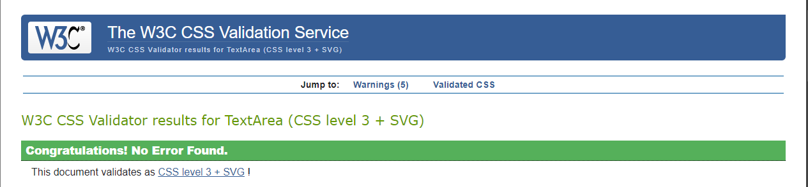

# Learn Golf | Testing

Return to [README](README.md)
- - -
Comprehensive testing has been performed to ensure the website's seamless and optimal functionality.

## Table of Contents
### [Responsiveness Testing](#responsiveness-testing-1)
### [Browser Compatibility Testing](#browser-compatibility-testing-1)
### [Device Testing](#device-testing-1)
### [Code Validation](#code-validation-1)
* [HTML Validation](#html-validation)
* [CSS Validation](#css-validation)
* [JavaScript Validation](#javascript-validation)
* [Python](#python)
### [Lighthouse Report](#lighthouse-report-1)
### [Bugs](#bugs-1)
* [Resolved Bugs](#resolved-bugs)
* [Unresolved Bugs](#unresolved-bug)
### [Features Testing](#features-testing-1)
---

## Responsiveness Testing

The deployed website underwent rigorous testing on multiple devices and screen sizes to ensure its responsiveness and adaptability. Developer Tools were utilized to simulate various screen sizes, enabling thorough examination of how the website behaves across different devices. Bootstrap classes and media queries were implemented to achieve the desired design, ensuring that the website maintains its visual and functional integrity on all platforms, enhancing the user experience.

 Desktop PC

 Laptop

 Tablet

 Mobile

## Browser Compatibility Testing

The project was tested on multiple web browsers to check for compatibility issues and ensure it functions as expected across all of them. This testing process guarantees a smooth and consistent user experience, regardless of the browser used.

## Device Testing

Device testing was conducted on a variety of phone models, including Samsung Galaxy A52, iPhone 15 and iPhone 14pro. The assistance of family members and friends was sought to perform the testing. This comprehensive approach ensured that the website was thoroughly evaluated on different devices and platforms, contributing to a more robust and user-friendly final product.

## Code Validation

### HTML Validation

 Home Page

 Sign Up Page

 Login Page

 Make a Booking Page

 Booking Success Page

### CSS Validation

 Custom CSS (style.css)

### JavaScript Validation

 Custom JS (script.js)

### Python

#### Accounts

 forms.py

 views.py

 urls.py

#### book_lessons app

 settings.py

 urls.py

 admin.py

 forms.py

 models.py

 views.py

## Lighthouse Report

 Home Page

 Careers Page

 Gallery Page

 Sign Up Page

 Login Page

 Make a Booking Page

 Booking Success Page

## Bugs

### Resolved Bugs

#### Footer Not sticking to the bottom of the login page

* When the site was deployed to heroku I noticed during testing that the footer wasnt styled correctly in the login page, I adjusted the padding and this resolved the issue.

### Unresolved Bugs

## Features Testing
 
| Page          | User Action   | Expected Result  | Notes            |
|---------------|---------------|------------------|------------------|
| Home Page     |               |                  |                  |
|               | Click on Logo | Redirect to Home Page | PASS        |
|               | Click on Lessons (Nav Bar) | Redirect to Login page | PASS |
|               | Click on Learn More button | Redirect to Lessons page | PASS |
|               | Click on Home (Navigation bar) | Move to Home Page | PASS |
|               | Click on Gallery | Redirect to Gallery page | PASS |
|               | Click on Careers Page | Redirect to Careers page | PASS |
|               | Click on social links in footer | Open new tab with appropriate link | PASS |
|               | Click on Logout (Navigation bar) | Redirect to Login page | PASS |
|               | Click on Login (Navigation bar) | Redirect to Login page | PASS |
| Booking Page (Logged In - User)  |                 |          |  |
|               | Enter Personal Details | Renders calendar and time slots | PASS |
|               | Book lesson | Redirects to success page | PASS |
|               | After Login | Users name is displayed at top of bookings page| PASS |
|               | Click on lessons (After creating booking)| List of bookings show | PASS |
|               | Click on Edit in Booking list | Open edit page | PASS |
|               | Click on Logout | Redirect to Login Page | PASS |
| Contact Page     |               |                  |                  |
|               | Click on social links | Open new tab with appropriate link | PASS |
| Sign Up Page  |                  |                  |                  |
|               | Enter invalid email | Field will only accept email address format | PASS |
|               | Enter valid email | No error | PASS |
|               | Email field left empty | Email is required | PASS |
|               | Type invalid password | Show Password Help | PASS |
|               | Type valid password | No error | PASS |
|               | Click Register with empty form | Fill in the form fields | PASS |
| Login Page  |                  |                  |                  |
|               | Click on Don't have an account? Register | Redirect to Register page | PASS |
|               | Try invalid username | Username is not correct | PASS |
|               | Try invalid password | Password is not correct | PASS |
|               | Valid password and username | No error | PASS |
|               | Click Sign In with empty form | Fill in the form fields | PASS |
| Logout Page  |                  |                  |                  |
|               | Click on Log Out button | Log user out | PASS |
| Booking Page  |                  |                  |                  |
|               | Click on Book Now button while form is empty | Fill in the form fields, alert message | PASS |
|               | Try to select dates in the past | They are disabled | PASS |
|               | Try to select already booked dates | They do not appear | PASS |
|               | Try to overlap your booking around the already booked dates | System will not allow | PASS |
|               | Enter valid form data | Redirect to success page | PASS |
| Booking Overview |  |    |    |
|               | Read the bookings | Results match users bookings and details of bookings | PASS |
|               | Click on Edit button | Redirect to Edit Booking page | PASS |
|               | Click on Delete button | Open Delete Booking Modal | PASS |
| Edit Booking Page |  |    |    |
|               | Try to select dates in the past | They are disabled | PASS |
|               | Try to select already booked dates | They are disabled | PASS |
|               | Try to overlap your booking around the already booked dates | System will not allow | PASS |
|               | Click on Save Changes button | Booking updated succesfully | PASS |
|               | Enter valid form data | Booking succesfully updated, alert message and a total price is calculated based on the booking | PASS |
|               | User fills in only check in, check out and num of guests | Booking succesfully updated, amenities are optional | PASS |
| Delete Booking Modal |  |    |    |
|               | Click on Confirm Delete button | Booking is deleted | PASS |
|               | Click on Cancel button | Close Delete Modal | PASS |
|               | Click outside of modal | Close Delete Modal | PASS |
| Admin Panel |  |    |    |
|               | CRUD functionality | Working as expected | PASS |

Return to [README](README.md)